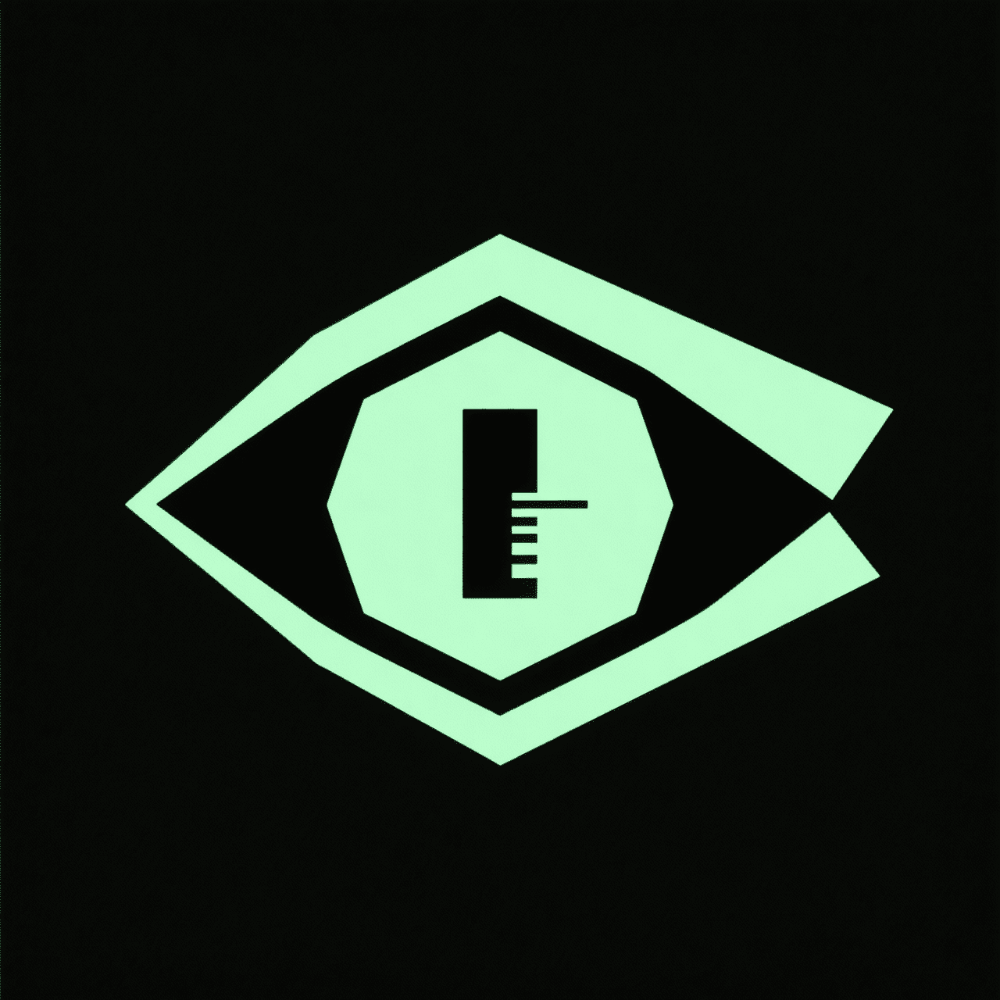

<p align="center">
  <a href="https://ibb.co/LDv9DQT6" target="_blank">
    
  </a>
</p>

<h1 align="center">AETHER</h1>

<p align="center">
  <strong>Advanced Engine for Theatrical and Electronic Rendering</strong>
</p>

<p align="center">
  <a href="https://github.com/aether-engine/aether" target="_blank"></a>
  
  
  
</p>

<br/>

AETHER is a headless, highly optimized multimedia creation engine written in **Rust**. It is designed specifically to be driven by **autonomous AI agents** and **multimodal skills** via a semantic **Domain Specific Language (DSL)** over a high-performance Client-Daemon architecture.

AETHER elevates AI-driven media generation by bridging the gap between raw generative models and professional-grade editing timelines, enforcing rigorous brand consistency through integrated vault systems, and planning multi-step creative goals using a state-of-the-art programmatic agent planner.

---

## 🌌 Architectural Overview

AETHER operates on an asynchronous Client-Daemon model communicating over **Unix Domain Sockets (UDS)**. It maintains the creative session in memory across separate CLI execution rounds, preventing expensive cold starts and allowing interactive REPL workflows.

```
                  ┌──────────────────────────────────────────┐
                  │          Human / AI Agent / MCP          │
                  └────────────────────┬─────────────────────┘
                                       │ (AETHER CLI & DSL)
                                       ▼
                  ┌──────────────────────────────────────────┐
                  │                AETHER CLI                │
                  └────────────────────┬─────────────────────┘
                                       │ (Unix Domain Socket)
                                       ▼
┌──────────────────────────────────────────────────────────────────────────────────────┐
│ AETHER DAEMON                                                                        │
│                                                                                      │
│ ┌──────────────────────┐   ┌──────────────────────┐   ┌────────────────────────────┐ │
│ │  Project Context     │   │  AETHER Vault        │   │  AETHER Planner            │ │
│ │  (Project Registry & │◄──┤  (Brand kits, character│◄──┤  (Goal decomposing &       │ │
│ │   isolated database) │   │   refs & guidelines) │   │   execution checklist)     │ │
│ └──────────┬───────────┘   └──────────┬───────────┘   └─────────────┬──────────────┘ │
│            │                          │                             │                │
│            ▼                          ▼                             ▼                │
│ ┌──────────────────────┐   ┌──────────────────────┐   ┌────────────────────────────┐ │
│ │  aether-core         │   │  aether-generate     │   │  aether-persistence        │ │
│ │  (Shared DSL types,  │──►│  (Rule-based prompts,│──►│  (SQLite, event logging,   │ │
│ │   snapshots, refs)   │   │   multi-model infra) │   │   atomic commit/rollbacks) │ │
│ └──────────────────────┘   └──────────┬───────────┘   └────────────────────────────┘ │
│                                       │                                              │
│                                       ▼                                              │
│                    ┌──────────────────┴──────────────────┐                           │
│                    │     Core Media Processing Engines   │                           │
│                    │  ┌──────────────┬──────────────┐    │                           │
│                    │  │  aether-video│  aether-audio│    │                           │
│                    │  ├──────────────┼──────────────┤    │                           │
│                    │  │  aether-image│  aether-anim │    │                           │
│                    │  └──────────────┴──────────────┘    │                           │
│                    └─────────────────────────────────────┘                           │
└──────────────────────────────────────────────────────────────────────────────────────┘
```

### Cargo Workspace Crate Topology

This project is organized as a modular, highly decoupled Cargo Workspace:

| Crate | Directory | Key Responsibility |
| :--- | :--- | :--- |
| **`aether-core`** | [`crates/aether-core/`](crates/aether-core/) | Universal domain types (Refs `@v1`, `@img1`, Snapshots, Errors, and command AST). |
| **`aether-cli`** | [`crates/aether-cli/`](crates/aether-cli/) | Lightweight CLI wrapper, argument parser, and interactive REPL shell. |
| **`aether-daemon`** | [`crates/aether-daemon/`](crates/aether-daemon/) | Long-running service holding the active memory session, timeline state, and worker loops. |
| **`aether-project`** | [`crates/aether-project/`](crates/aether-project/) | Core project lifecycle registry, context resolver, and absolute isolation manager. |
| **`aether-vault`**| [`crates/aether-vault/`](crates/aether-vault/) | Stable creative repository for brand assets, character design sheets, and layout rules. |
| **`aether-planner`**| [`crates/aether-planner/`](crates/aether-planner/) | AI-agent checklist orchestrator, handling plan validation, execution state, and evidence tracking. |
| **`aether-generate`**| [`crates/aether-generate/`](crates/aether-generate/) | AI orchestration layer, hosting model registries, the `prompt-maker` enricher, and provider APIs. |
| **`aether-persistence`**| [`crates/aether-persistence/`](crates/aether-persistence/) | Transactional SQLite engine for job logging, metadata, branch indexing, and two-phase atomic rollbacks. |
| **`aether-video`** | [`crates/aether-video/`](crates/aether-video/) | Hardware-accelerated decoder/encoder, keyframe timeline compositor, and FFmpeg interface. |
| **`aether-audio`** | [`crates/aether-audio/`](crates/aether-audio/) | Multi-format Symphonia decoder, parametric DSP rack (Compressor, EQ, Limiter), and voice enhancements. |
| **`aether-image`** | [`crates/aether-image/`](crates/aether-image/) | Drawing canvas, vector parsing (resvg/tiny-skia), drop shadows, layer effects, and color metrics. |

---

## 🗃️ 1. Explicit Project Management Layer

To prevent implicit folder contamination and support complex, multi-agent workspaces, AETHER enforces a strict **Project Layer**. Agents and humans must work within an explicitly created project boundary. 

Every project is isolated, containing its own SQLite database (`.aether/metadata.db`), cache, locks, and history. Normal media commands **never** implicitly initialize a `.aether` folder in random directories, avoiding silent workspace pollution.

### Project Lifecycle Commands

```bash
# Create a new isolated project (optionally adopted or adopt-or-force)
aether project create spot_luxury_watch --dir ~/work/aether/spot_luxury_watch

# Open/Resume an existing project and mark it as active
aether project open spot_luxury_watch

# Get JSON details of the active project and UDS socket connection
aether project current

# List all registered projects on the system and their availability status
aether project list

# Close the active project session cleanly (stops the project daemon, flushes SQLite)
aether project close

# Delete a project (recursively cleans files, or moves to trash corbeille for safety)
aether project delete spot_luxury_watch --archive
aether project delete spot_luxury_watch --force
```

### Context Resolution Protocol

When a command is run, AETHER resolves the active context in this strict priority:
1. **Explicit Option**: `--project <name-or-path>` flag passed to the command.
2. **Environment Variable**: `AETHER_PROJECT` set in the executing shell environment.
3. **Registry Record**: The system-wide active project set in `~/.config/aether/projects.json`.
4. **Current Directory**: If `<cwd>/.aether` exists, it acts as a local override fallback.
5. **No Context Error**: If no active project is located, AETHER terminates safely with a clear guidance error message: `No active AETHER project. Run 'aether project create' or 'aether project open'.`

---

## 🏛️ 2. AETHER Vault (Creative & Brand Memory Layer)

When executing generative requests, creative teams need persistent assets (monochrome logos, typography, color palettes, recurrent character sheets, audio jingles, legal constraints) to remain identical across drafts. 

**AETHER Vault** acts as a long-term, versioned creative storehouse. Multiple projects can attach to one or more Vaults, referencing durable assets globally without duplicating files or polluting temporary workspaces.

```
                      ┌────────────────────────────────────────┐
                      │              Global Vault              │
                      │       ~/.local/share/aether/vaults/    │
                      └────┬──────────────────────────────┬────┘
                           │                              │
                           ▼                              ▼
                 ┌───────────────────┐          ┌───────────────────┐
                 │ Vault: brand_lux  │          │ Vault: char_aria  │
                 │ - primary logo    │          │ - front view ref  │
                 │ - color palette   │          │ - profile view ref│
                 │ - design rules    │          │ - negative prompts│
                 └─────────┬─────────┘          └─────────┬─────────┘
                           │ (linked)                     │ (linked)
                           └──────────────┬───────────────┘
                                          ▼
                               ┌─────────────────────┐
                               │ Project: ad_holiday │
                               │ .aether/vaults.json │
                               └─────────────────────┘
```

### Vault Management Commands

```bash
# Create a brand, character, product, or campaign vault
aether vault create brand maison_lux_time
aether vault create character aria_ambassador

# Add key assets into the vault (copies files to safe store, generates blake3 hash)
aether vault add logo maison_lux_time ./logo_primary.png --variant primary --usage generate-image,export-branding
aether vault add palette maison_lux_time --colors "#C9A646,#111111,#F4F0E8"
aether vault add rule maison_lux_time "Never stretch the logo. Keep a minimum clear space of 8%."
aether vault add persona maison_lux_time ./luxury_tone.md

# Add multi-angle character references for model conditioning
aether vault add character-ref aria_ambassador ./aria_front.png --view front
aether vault add character-ref aria_ambassador ./aria_profile_left.png --view profile-left
aether vault add character-ref aria_ambassador ./aria_full_body.png --view full-body
aether vault add negative-prompt aria_ambassador "Do not change hair color. Do not alter facial structure."

# Query and manage vault connections inside projects
aether vault attach maison_lux_time --project spot_luxury_watch --alias brand
aether vault attached --project spot_luxury_watch
aether vault show maison_lux_time
aether vault search "character aria front view"
```

### Vault-to-Generative Integration

When a generation command is executed, AETHER resolves attached vaults, extracts brand constraints, and injects them directly into the generative pipeline:
- **Reference URI Syntax**: Agents refer to vault items via strict URIs: `vault://maison_lux_time/logo/primary` or `@vault:brand.logo_primary`.
- **Allowed Providers Policy**: Secure files can be locked (e.g., `restricted: true` in metadata) to only execute on certified internal models, failing closed to prevent leaks to unauthorized public APIs.

---

## 📋 3. AETHER Planner (Goal-to-Checklist Agent Orchestrator)

AETHER Planner acts as an intermediate AI coordinator, translating high-level creative briefs into executable checklists. Instead of having agents memorize sequence timelines and asset references, they feed the brief to AETHER Planner, which builds a validated, traceable, and reversible roadmap.

```
 Brief ──► [ Planner ] ──► Validated Step Checklist ──► [ Agent Exec Loop ] ──► physical evidence check
```

Each step in a plan maintains state (`pending`, `ready`, `running`, `done`, `failed`, `needs_revision`) and requires **verifiable physical evidence** (such as a database record, a generated Blake3 hash, or concrete image metadata) before it can be checked off.

### Plan Orchestration Commands

```bash
# Decompose a creative brief into a structured, step-by-step checklist
aether plan create "Create a 20s cinematic video featuring brand ambassador Aria, adding a luxury music bed, dynamic voice off, and logo watermark on the final frames."

# Display the current checklist, step status, and direct command syntaxes
aether plan show

# Verify the validity of all planned commands against the active DSL parser
aether plan validate

# Determine the next runnable step whose dependencies are fully satisfied
aether plan next

# Check off a step (succeeds only if the required physical evidence is verified on disk)
aether plan check S1

# Revise a plan dynamically without losing progress (e.g., insert a step or modify options)
aether plan revise "Insert a compressor onto voice-off before final mix-tracks"
```

---

## 🗣️ 4. AETHER DSL: AI-Driven Long Grammar

AETHER's core power lies in its **Domain Specific Language (DSL)**. It features a complete long-form grammar optimized for AI models, coupled with short aliases to preserve backward compatibility.

### Generative Command Grammar

```text
# 1. Storyboard Generation
generate storyboard-scratch <"user_brief"> [--model <model_id>] [--options <json>]
# Creates: @g1 (a detailed step-by-step visual script JSON)

# 2. Image Generation
generate image <"detailed_prompt"> [--inputs <refs>] [--model <model_id>] [--options <json>]
# Creates: @img1 (an image asset)

# 3. Audio & Voice Generation
generate voice <"text_content"> [--voice <voice_ref>] [--model <model_id>] [--options <json>]
# Creates: @a1 (synthesized speech WAV/MP3)

# 4. Music Generation
generate music <"musical_prompt"> [--model <model_id>] [--options <json>]
# Creates: @a2 (background music track)

# 5. Video Generation
generate video-frame <@img_ref> <"camera_movement_prompt"> [--model <model_id>] [--options <json>]
# Creates: @v1 (motion-synthesized video clip)

# 6. Status and Cancellation Management
generation status [<@job_ref>]
generation cancel <@job_ref>
```

### Core Engine Grammar

#### Video Engine (`aether-video`)
- `import "./raw.mp4"`: imports video and registers as `@v1`.
- `inspect @v1`: generates contact sheets, detects frame-rate, color space, and proxy information.
- `trim @v1 <start_s> <end_s>`: crops a clip and produces a new reference.
- `concat @v1 @v2 --transition <Crossfade|Slide|Wipe>`: joins video segments with transitions.
- `speed @v1 <ratio>`: speeds up or slows down video.
- `detect-cuts @v1`: runs static analysis to return segment cut timestamps.
- `auto-reframe @v1 --aspect <9:16|1:1>`: utilizes smart crops or motion tracking to reframe layouts.
- `bake @v1 --format <mp4|mov>`: pre-renders intermediate timeline composites.
- `export @v_final mp4 h264 high`: compiles the video to the final destination.

#### Audio Engine (`aether-audio`)
- `import "./bg_track.wav"`: registers audio as `@a1`.
- `trim @a1 <start_s> <end_s>`: trims audio length.
- `mix @a1 <decibel_offset>`: adjusts gains.
- `eq @a1 <highpass|lowpass|peaking> <freq_hz> <gain_db> <q_factor>`: applies parametric equalizer filters.
- `compress @a1 <threshold_db> <ratio> <attack_ms> <release_ms>`: dynamic range compressor.
- `mix-tracks @a1 @a2 --weights "0.7,0.3"`: mixes multiple audio tracks down to stereo.
- `detect-transients @a1`: identifies percussive hits, beats, and onset timings.
- `strip-silence @a1 --threshold <decibels>`: auto-removes silence gates from voice tracks.
- `apply-fades --targets @a1 --in <duration_ms> --out <duration_ms>`: smooths transitions to prevent pops.
- `enhance-voice @a1`: applies adaptive noise gates, high-passes, and exciters.

#### Image & Graphic Engine (`aether-image`)
- `canvas <width> <height> <color>`: creates empty canvas `@img1`.
- `draw_text @img1 "text" <font_family> <font_size> <x> <y>`: draws typography layers.
- `vignette @img1 --amount <0.0-1.0>`: applies shading to borders.
- `blend-if @img_top over @img_base --condition <luminance|alpha> --thresholds <low> <high>`: advanced overlay blends.
- `layer-style @img1 <drop-shadow|inner-glow|stroke> [--color <color>] [--offset <x,y>]`: vector design styling.
- `analyze-color @img1`: extracts standard-compliant color histograms and dominant color tokens.

#### Timeline & Motion Design Engine
- `group-clips @v1 @a1 as scene_intro`: gathers multiple tracks into nested, moveable sub-timelines.
- `move-group scene_intro --to <timestamp_ms>`: offsets nested assets collectively.
- `lock-time @v1`: prevents accidental shifting of assets on the timeline.
- `create-adjustment --effects "vignette:0.25,color-grade:warm"`: creates overlay effect layers affecting all clips beneath them.
- `keyframe-set @img1.opacity <time_ms> <value> --interpolation <linear|bezier:x1,y1,x2,y2>`: keyframe automation.
- `expression set @img1.rotation "time * 30"`: programmatic calculations driving attributes.
- `particles create <rain|snow|sparkles>`: spawns procedural layers.

---

## ⚡ 5. Multimodal AI Generation Layer

AETHER integrates a state-of-the-art **AI Generation Layer** (`aether-generate`). It abstracts advanced generative models behind clean interfaces, facilitating model swaps without rewriting timelines.

### Out-of-the-Box Provider Integrations

AETHER natively connects to elite generative networks:

```
                   ┌──────────────────────────────────┐
                   │        aether-generate           │
                   └────────────────┬─────────────────┘
                                    │ (Unified API)
                                    ▼
       ┌────────────────────────────┼────────────────────────────┐
       │                            │                            │
       ▼                            ▼                            ▼
┌──────────────┐             ┌──────────────┐             ┌──────────────┐
│   Google     │             │   MiniMax    │             │   Wan/Veo    │
│  (Veo 3.1,   │             │   (Speech,   │             │  (Wan 2.5,   │
│   Imagen 3,  │             │    TTS,      │             │   Banana 1.0 │
│   Lyria)     │             │    Clones)   │             │   Video)     │
└──────────────┘             └──────────────┘             └──────────────┘
```

- **Google Veo 3.1 & Lyria**: Cinematic cinematic video synthesis and orchestral musical tracks.
- **Imagen 3**: Photorealistic, brand-aligned image generation.
- **MiniMax Speech & TTS**: High-fidelity, emotionally-expressive voiceovers and natural speaker clones.
- **Wan 2.5 & Nano Banana**: High-resolution video synthesis and frame-to-video movements.
- **Offline Mock Provider**: Every single generative command runs on a local **MockProvider** by default, generating mock JSON files offline (no API keys, zero network fees). This allows 100% stable, deterministic testing and agent validation out of the box.

---

## 🧪 6. Getting Started & Testing Workspace

### Prerequisites

Ensure you have Rust, Cargo, and FFmpeg developmental libraries installed on your machine:

```bash
# Ubuntu/Debian
sudo apt-get install -y build-essential pkg-config libssl-dev libavcodec-dev libavformat-dev libavfilter-dev libavdevice-dev libswscale-dev libswresample-dev

# macOS
brew install ffmpeg pkg-config
```

### Building and Compilation

Compile the entire workspace, including all core, CLI, media, and agent engines:

```bash
cargo build --workspace --release
```

### Verification & Testing Suite

AETHER relies on a robust verification matrix spanning unit, integration, and E2E behavioral tests:

```bash
# Execute the complete project test suite (100% coverage baseline)
cargo test --workspace

# Start the interactive testing daemon for manual DSL input
cargo run -p aether-daemon -- ~/work/aether_test_project

# Launch a project CLI command to verify client-daemon socket health
cargo run -p aether-cli -- project current
```

AETHER includes an E2E test harness covering 13 programmatic validation stages (Suite 0 to 12). These suites test file structure, project rollbacks, asset registration, DSP chains, video concatenations, timeline shifts, and planner checklist completions, proving AETHER's readiness for production agent deployment.

---

## 🎬 7. End-to-End Agent Workflow Example

Here is a typical session of an AI agent decomposing a creative brief, executing steps, validating assets, and cleaning up a luxury watch advertisement project:

```bash
# 1. Project Initialization & Context Setup
aether project create ads_lux_2026 --dir /tmp/ads_lux_2026
aether project open ads_lux_2026

# 2. Memory Attachment
aether vault attach brand_lux_time --alias brand
aether vault attach aria_ambassador --alias actor

# 3. Goal Decomposition
aether plan create "Synthesize a 15-second watch teaser using brand colors, generating a cinematic storyboard, actor-aligned images, moving video, voiceovers, and a final h264 export."
aether plan show

# [S1] Generate Storyboard
aether generate storyboard-scratch "15s commercial for gold watch"
aether plan check S1

# [S2] Generate Actor-Aligned Image Hero
aether generate image "front view shot of Aria wearing gold watch" --inputs @vault:actor.front
aether plan check S2

# [S3] Generate Motion Video
aether generate video-frame @img1 "slow cinematic pan right"
aether plan check S3

# [S4] Generate Voiceover Speech
aether generate voice "Precision meets timeless luxury." --voice @vault:brand.voice
aether plan check S4

# [S5] Mix Tracks & Build Timeline
aether trim @v1 0.0 15.0
aether enhance-voice @a1
aether mix-tracks @v2 @a2
aether plan check S5

# [S6] Apply Watermark Brand Overlays
aether blend-if @vault:brand.logo_primary over @v3 --condition alpha
aether plan check S6

# [S7] Render Final Composition
aether export @v4 mp4 h264 high
aether plan check S7

# 4. Safe Session Shutdown
aether project close
```

AETHER represents the ultimate convergence of professional media production and agentic AI execution. 

---

## 📄 License

Licensed under the MIT License. See [LICENSE](LICENSE) for details.
